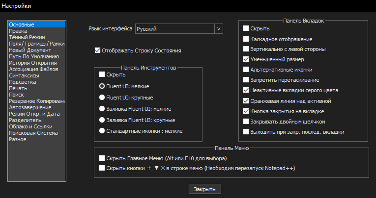
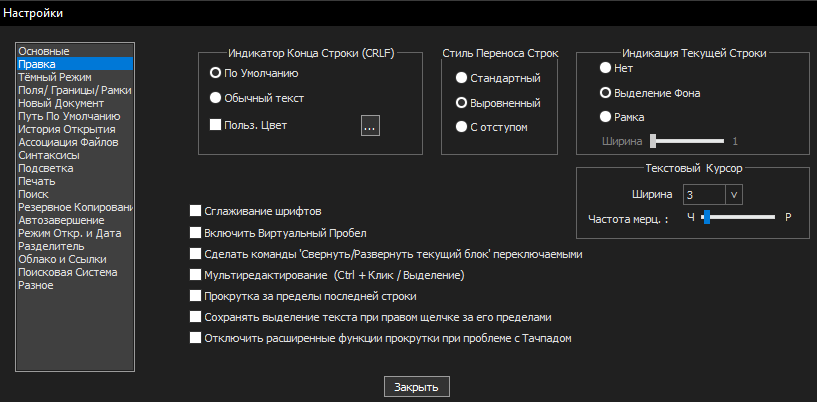

# Настройка шрифта в `Notepad++`

## Синтаксис:

`Python` или `Shell`

## Определение стилей:


## Основные настройки:


## Правка:


## Поля/Границы/Рамки:


## Новый Документ:

Синтаксис по умалч.: `[Python]`

## Подсветка:


## Поиск:


## Hot Keys:
```php

[Ctrl] + [S]  # сохранить файл

[Ctrl] + [N]  # создать новый файл

[Ctrl] + [W]  # закрыть файл

[Alt] + [F6]  # Открыть Notepad++ в двух окнах

Зажатый [Alt] # Выделение/редактирование столбцов

[Ctrl] + [Shift] + [T] # Открыть последний закрытый файл

```


## Автонумерация в `Notepad++`

```php
Выделяем строки:
Зажимаем [Alt]+[Shift]+[Стрелка]

Активируем генератор столбца:
Нажимаем [Alt] + [C]

Выбираем [Числа для вставки]
Исходное число: 1
Увеличение на: 1

Повтор: 0 (этот параметр означает сколько раз повторится каждое число)
```


